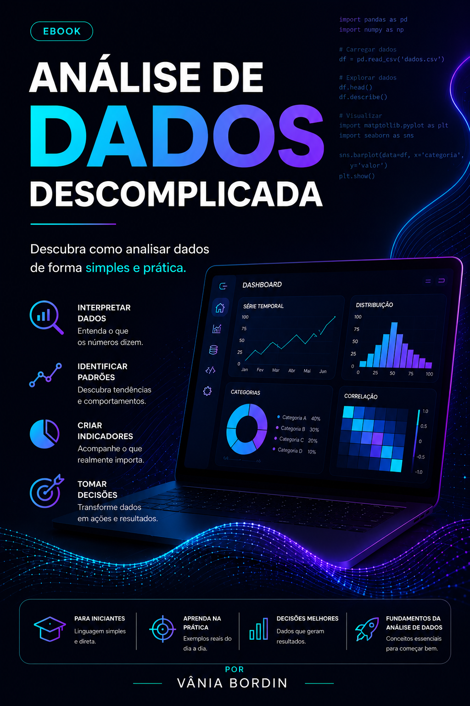

# 📚 E-book: Análise de Dados Descomplicada

<p align="center">
  
</p>

<p align="center">
  <strong>Um guia visual para quem deseja dar os primeiros passos na Análise de Dados.</strong>
</p>

---

## 🎯 Objetivo

Este projeto foi desenvolvido como parte do desafio **"Criando um E-book com ChatGPT"** da DIO.

O objetivo é apresentar os principais conceitos da **Análise de Dados** de forma simples, prática e acessível, utilizando **Inteligência Artificial Generativa** como apoio na criação do conteúdo, estruturação dos capítulos e desenvolvimento dos ativos visuais.

---

## 🚀 Tecnologias e Ferramentas

- 🤖 **ChatGPT (OpenAI)** — Estruturação do conteúdo, criação dos capítulos e engenharia de prompts.
- 🎨 **Leonardo AI** — Geração da arte da capa.
- 📑 **Microsoft PowerPoint** — Diagramação do e-book.

---

# 📖 Estrutura do E-book

O conteúdo foi organizado em dez capítulos curtos, utilizando linguagem simples e exemplos do cotidiano.

| Capítulo | Tema |
|----------|------|
| 01 | Dados estão em todo lugar |
| 02 | Nem todo número conta uma história |
| 03 | Comece pelo básico |
| 04 | Os dados mostram padrões |
| 05 | Comparar é mais importante do que olhar um número isolado |
| 06 | Gráficos facilitam a compreensão |
| 07 | Nem sempre mais dados significam melhores decisões |
| 08 | Transforme dados em ação |
| 09 | Você não precisa ser um cientista de dados |
| 10 | Conclusão: Dados são aliados das boas decisões |

---

# 🤖 Prompts Utilizados

Durante o desenvolvimento do projeto, a Inteligência Artificial foi utilizada para apoiar diferentes etapas da criação do e-book.

## 1️⃣ Criação do título (ChatGPT)

> **"Crie um título para um eBook sobre Análise de Dados voltado para iniciantes. O título deve ser simples, divertido e curto, com aprendizado fácil e linguagem acessível. Evite termos muito técnicos."**

---

## 2️⃣ Geração da capa (Leonardo AI)

> **"Modern futuristic eBook cover, dark background, premium tech design, neon blue and purple lighting, laptop displaying professional data analytics dashboard with line chart, bar chart, pie chart and heatmap, Python code floating in background, glowing data waves, business intelligence interface, bold typography, title 'ANÁLISE DE DADOS DESCOMPLICADA', cyberpunk aesthetic, clean layout, editorial quality, Amazon bestseller style, ultra detailed, high contrast, 4K, vertical A4."**

---

## 3️⃣ Síntese Visual para Diagramação (ChatGPT)

Para destacar a mensagem principal de cada capítulo durante a diagramação, foi utilizado o seguinte prompt:

> **"Resuma o conteúdo principal de cada capítulo em frases de impacto curtas de no máximo 30 palavras, adequadas para telas de apresentação e diagramação em e-books visuais."**

### Resultado

| Capítulo | Síntese |
|-----------|----------|
| Dados estão em todo lugar | Os dados fazem parte da sua rotina. O verdadeiro diferencial está em saber interpretá-los para tomar melhores decisões. |
| Nem todo número conta uma história | Números só fazem sentido quando fazemos as perguntas certas. A análise começa com curiosidade, não com planilhas. |
| Comece pelo básico | Poucos indicadores bem escolhidos já revelam informações valiosas para melhorar resultados e apoiar decisões. |
| Os dados mostram padrões | Analisar dados ao longo do tempo permite identificar tendências, prever problemas e descobrir novas oportunidades. |
| Comparar é mais importante do que olhar um número isolado | Um número isolado informa pouco. Comparações revelam contexto, evolução e ajudam a transformar dados em conhecimento. |
| Gráficos facilitam a compreensão | Boas visualizações tornam informações complexas mais fáceis de entender e aceleram a tomada de decisão. |
| Nem sempre mais dados significam melhores decisões | O valor dos dados está na relevância, não na quantidade. Foque no que realmente importa. |
| Transforme dados em ação | Analisar é apenas o começo. O verdadeiro impacto acontece quando as informações geram decisões e mudanças. |
| Você não precisa ser um cientista de dados | Pensamento analítico vale mais que ferramentas. Qualquer pessoa pode usar dados para resolver problemas. |
| Conclusão | Dados complementam a experiência, reduzem a incerteza e ajudam a enxergar oportunidades escondidas nos números. |

---

# 📁 Estrutura do Repositório

```text
📦 analise-dados-descomplicada
├── assets/
│   └── capa-ebook.png
├── output/
│   └── Analise_de_Dados_Descomplicada.pdf
├── prompts/
│   └── prompts-utilizados.md
└── README.md
```

---

# 📚 Visualizar o E-book

O e-book completo está disponível neste repositório em formato PDF.

📄 **Analise_de_Dados_Descomplicada.pdf**

---

# 👩‍💻 Autora

**Vânia Bordin**

Projeto desenvolvido para fins educacionais e composição de portfólio na área de **Ciência de Dados**.

---

## 💙 Agradecimentos

Projeto desenvolvido durante o desafio **"Criando um E-book com ChatGPT"** promovido pela **DIO (Digital Innovation One)**, explorando o uso da Inteligência Artificial na criação de conteúdo técnico.
